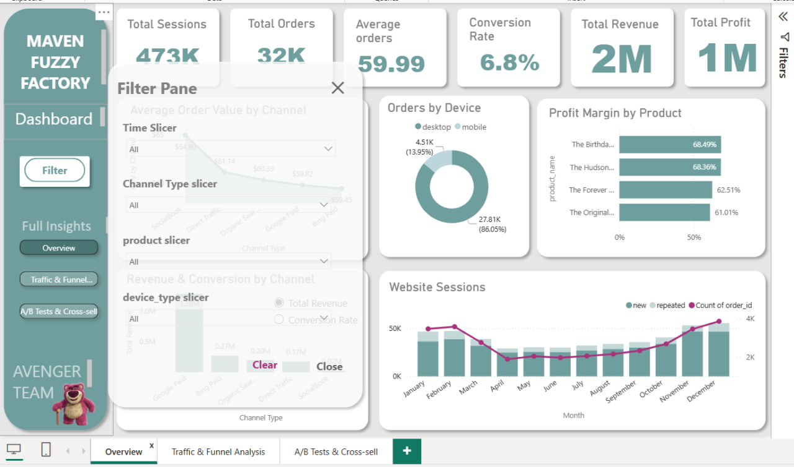
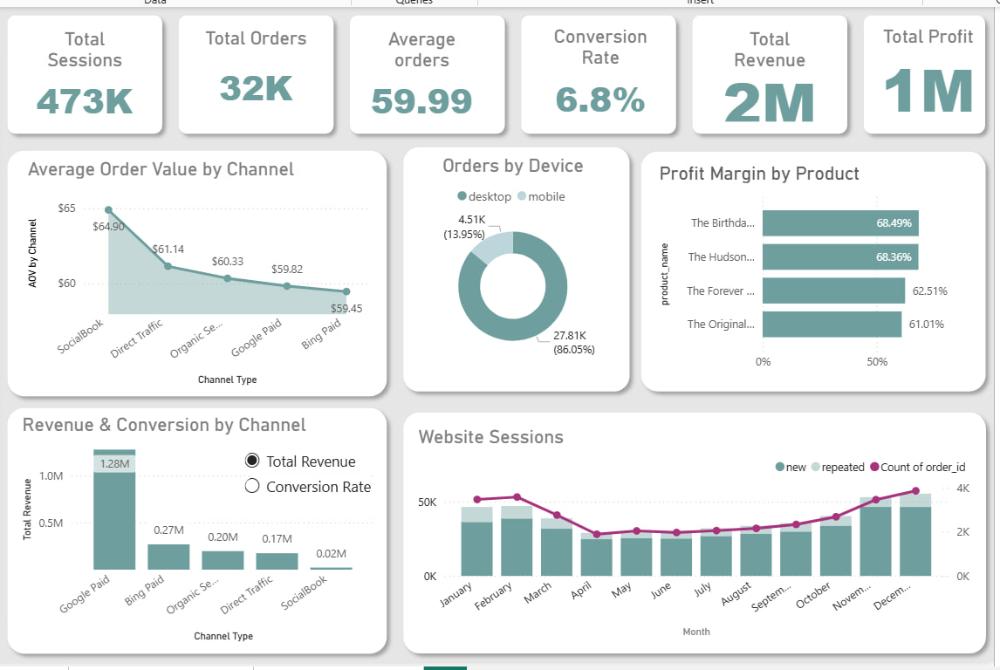
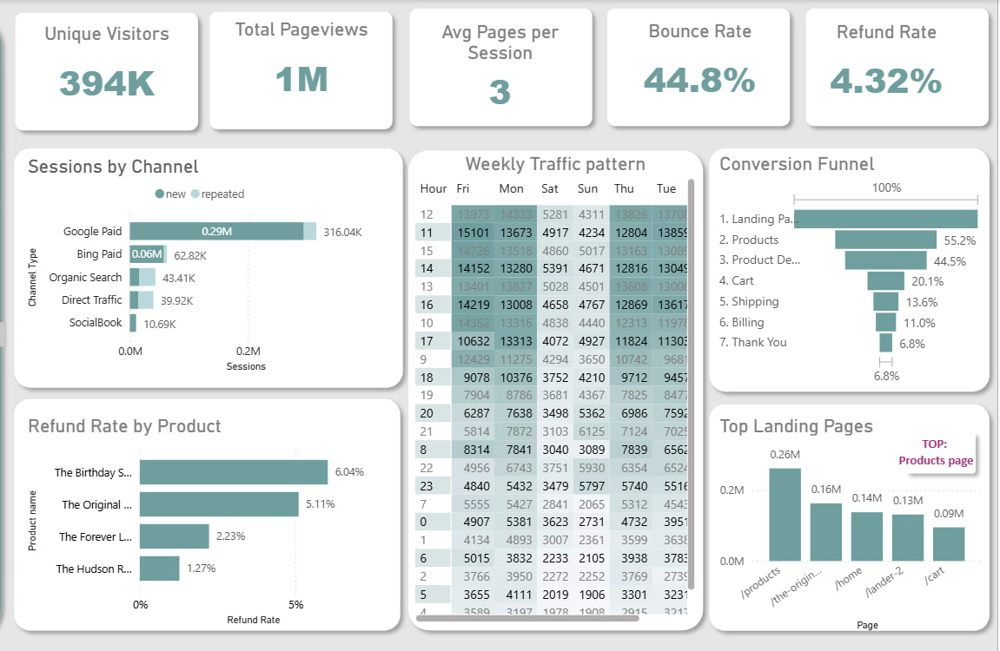
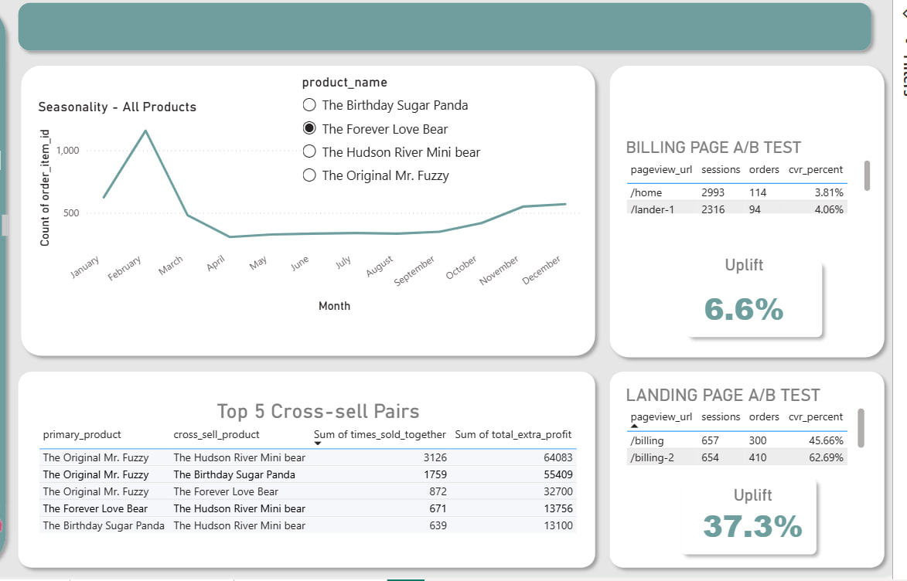

# 👋 Hi, I'm Alyaa Mohammed – Data Analyst

## 🧸 Maven Fuzzy Factory – Business Analytics Project

An end-to-end data analysis project for a US-based e-commerce plush toy company, from raw data to an interactive dashboard and strategic recommendations.

---

### 📊 Dashboard (3 Pages + Filters)

  
*Interactive filters and slicers used in the dashboard*

  
*Executive Overview – KPIs, revenue trends, channel performance, and product margins*

  
*Traffic sources, conversion funnel, bounce rate, and customer behavior patterns*

  
*Landing page & billing page A/B test results, cross-sell opportunities, and seasonality*

---

### 📁 Dataset Overview

We worked with **6 interconnected tables**:

| Metric | Value |
|--------|-------|
| Website Sessions | 472,871 |
| Pageviews | 1,188,114 |
| Orders | 32,305 |
| Order Items | 40,025 |
| Refunds | 1,731 |
| Products | 4 |

---

### 🛠️ Tools Used

| Tool | Purpose |
|------|---------|
| **MySQL** | Data storage, cleaning, and querying |
| **MySQL Workbench** | Database management and SQL scripts |
| **MySQL ODBC Driver** | Connecting Power BI to MySQL |
| **Power BI Desktop** | Building interactive dashboards |
| **DAX** | Creating measures and calculations |
| **Excel** | Quick calculations and validation |

---

### 📈 Key Results

| Metric | Value |
|--------|-------|
| **Total Revenue** | **$2.0M** |
| **Total Profit** | **$1.22M** (62.7% margin) |
| **Conversion Rate** | **6.8%** |
| **Total Sessions** | **473K** |
| **Total Orders** | **32K** |
| **Average Order Value** | **$59.99** |
| **Bounce Rate** | **44.8%** |
| **Refund Rate** | **4.3%** |

---

### 🔍 Key Insights

**Business Growth & Performance**
- Scaled from 1 product (2012) to 4 products (2014) with consistent revenue growth
- 19% of orders from repeat customers, who spend 15% more per order

**Marketing & Channel Performance**
- Top revenue channel: **gsearch (Google)** – $800K
- Organic + Direct traffic generate **$273K with zero ad spend**
- Desktop drives **86% of orders**; mobile only 14% despite higher AOV
- Peak traffic: Weekdays, 11 AM – 4 PM (working hours behavior)

**Customer Journey & Funnel**
- Biggest drop-off: **38% from Product Detail → Cart**
- Bounce Rate improved from **57.2% to 44.8%** after landing page optimization
- Average session duration: ~4 min, with ~3 pages per session

**A/B Testing Results**
- **Landing Page Test**: +6.56% uplift (3.81% → 4.06%)
- **Billing Page Test**: +37.3% uplift (45.66% → 62.69%)

**Product Performance**
- Highest margin: **Love Bear (40%)** vs Mr. Fuzzy (30%)
- Top cross-sell pair: **Mr. Fuzzy + Mini Bear** – 3,126 times, $64K extra profit
- Love Bear shows seasonal demand spikes in **February & July**
- Sugar Panda & Love Bear have higher refund rates (quality/expectation check needed)

**Data Quality Achievements**
- Fixed 8 invalid orders, 15 missing product IDs, 10 timestamp errors
- Standardized all text fields (lowercase, trimmed spaces)

---

### 💡 Strategic Recommendations

| Recommendation | Expected Impact |
|----------------|-----------------|
| **Fix the Funnel** – A/B test "Add to Cart" button | +10% conversion → $108K/month |
| **Reallocate Budget** – Shift to Love Bear (higher margin) | +$70K profit |
| **Launch Loyalty Program** – 10% discount, early access | +$372K/year |
| **SEO/Content Marketing** – Invest in organic growth | +$250K/year |
| **Improve Mobile Experience** – Optimize mobile conversion | Increased revenue |

---

### 📋 Key Recommendations Summary

1. Fix the Funnel – 38% drop-off from product detail to cart  
2. Reallocate Marketing – Shift budget to Love Bear (40% vs 30% margin)  
3. Launch Loyalty Program – 19% repeat customers spend 15% more  
4. SEO/Content Marketing – Free channels bring $273K – invest more  
5. Mobile Optimization – Mobile AOV higher but only 14% of traffic  

---

### 💰 ROI Forecast ($100K Investment)

*Based on dashboard insights and projected impact of strategic recommendations*

| Initiative | Investment | Annual Return | ROI |
|------------|------------|---------------|-----|
| Fix the Funnel | $20,000 | $1,260,000 | 63x |
| Love Bear Reallocation | $30,000 | $70,000 | 2.3x |
| SEO/Content Marketing | $25,000 | $250,000 | 10x |
| Loyalty Program | $25,000 | $372,000 | 15x |
| **TOTAL** | **$100,000** | **$1,952,000** | **~20x** |

---

### 🏆 Hackathon Achievement

Developed for the **Digital Egypt Builders Initiative (DEBI) Business Analytics Hackathon** – **1st Place 🏆**

**Team Avenger:**  
Alyaa Mohammed, Donia Ayman Eid, Hesham Yahya, Hassan Tamer, Hassan Shawki

---

### 🔗 Links

- **Live GitHub Page:** [https://Alyaa-Mohammed.github.io](https://Alyaa-Mohammed.github.io)  
- **GitHub Repository:** [https://github.com/Alyaa-Mohammed/Alyaa-Mohammed.github.io](https://github.com/Alyaa-Mohammed/Alyaa-Mohammed.github.io)  
- **LinkedIn Post:** [Click here](https://lnkd.in/e8Fye2pj)  
- **Power BI Dashboard:** *Coming soon*

---

### 📬 Connect with Me

  

---

> *"Connecting multiple data points to uncover insights that drive actionable business decisions."*
